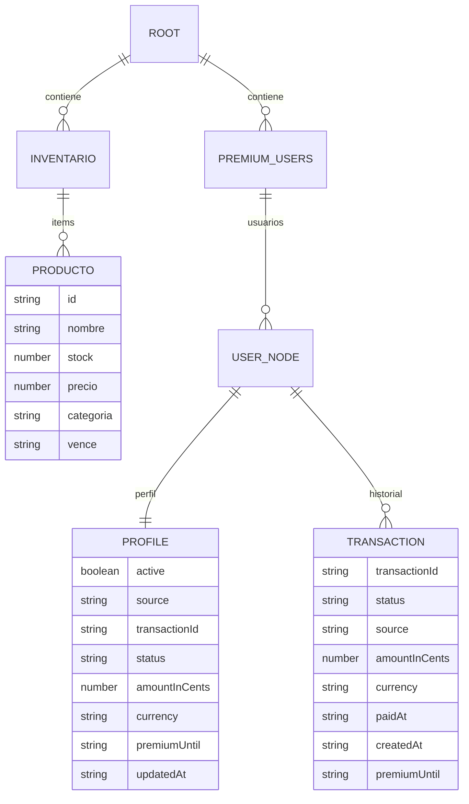
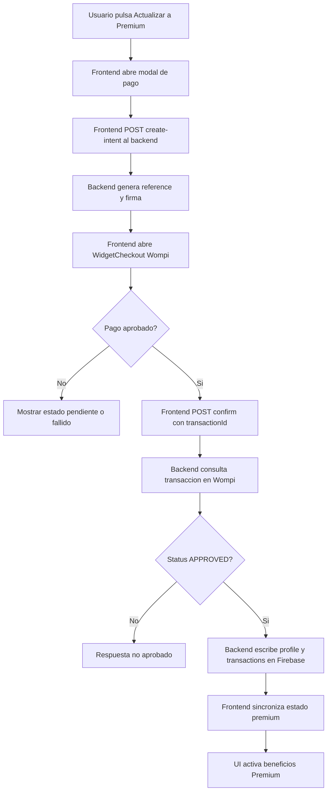

# Esquema Firebase + Premium (Vital Market)

## 1) Estructura de Realtime Database



Ruta sugerida en RTDB:

- inventario/{productoId}
- premiumUsers/{userId}/profile
- premiumUsers/{userId}/transactions/{transactionId}

Ejemplo profile:

```json
{
  "active": true,
  "source": "wompi",
  "transactionId": "123456-abc",
  "status": "APPROVED",
  "amountInCents": 1990000,
  "currency": "COP",
  "premiumUntil": "2026-04-27T20:00:00.000Z",
  "updatedAt": "2026-03-27T20:00:00.000Z"
}
```

## 2) Flujo Premium (Wompi + Backend + Firebase)



## 3) Reglas de seguridad recomendadas (RTDB)

Opcion minima temporal (solo pruebas):

```json
{
  "rules": {
    "inventario": {
      ".read": true,
      ".write": true
    },
    "premiumUsers": {
      ".read": true,
      ".write": true
    }
  }
}
```

Opcion recomendada con Auth (produccion):

```json
{
  "rules": {
    "inventario": {
      ".read": "auth != null",
      ".write": "auth != null"
    },
    "premiumUsers": {
      "$userId": {
        ".read": "auth != null && auth.uid == $userId",
        "profile": {
          ".write": "auth != null && auth.uid == $userId"
        },
        "transactions": {
          ".write": "auth != null && auth.uid == $userId"
        }
      }
    }
  }
}
```

Nota importante:

- Para produccion real, idealmente solo el backend debe escribir premiumUsers.
- En ese caso se recomienda Admin SDK en backend para evitar escrituras desde cliente.
